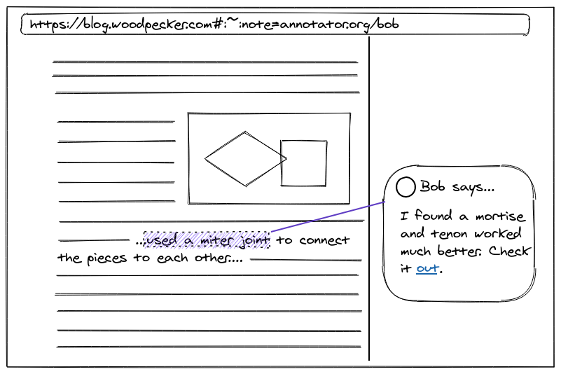
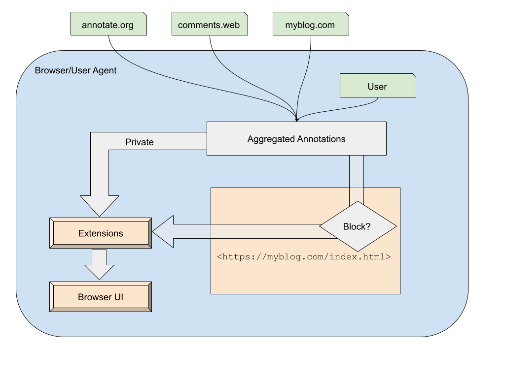
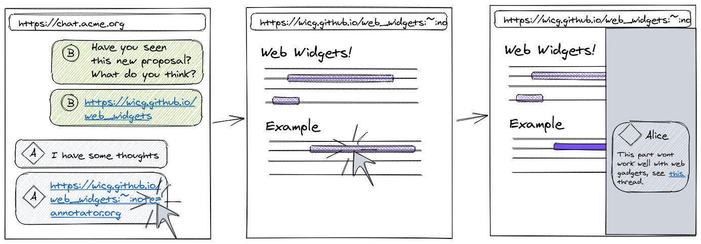

# WebAnnotation in the Browser
Created: April 2021  
Modified: May 2021

_Note: Please feel free to start disucssions or bring up feedback in issues (either existing or create new ones). If you'd rather leave feedback non-publically reach out to bokan@chromium.org_

## Introduction

Links are the web’s superpower. Being able to connect content to other related destinations is an incredibly powerful concept that led to the explosion and richness of the web. However, functionally, hyperlinks are largely unchanged from when they were introduced 30 years ago. They allow authors to link content, but only in a navigational sense and without preserving context; users are often left as passive observers and consumers. Increasingly, users are expecting and spending time in apps that provide a more interconnected experience, not just between content but with other users.

Today’s hyperlinks exist within documents, meaning only the author can link to other resources. What if we introduce a new kind of link, one that is non-navigational, exists outside of a document, and can link to bite-sized resources displayable within the context of a larger document? The [text-fragment feature](https://github.com/WICG/scroll-to-text-fragment) recently made links more granular - we could build on this to give links more meaning and context.

This would allow users to make connections and remarks on top of the existing web, making it more open and collaborative. We believe that content is most compelling when people can react to it, build on it, and enrich it, creating an additional dimension to the original work. Allowing users to participate in shaping the content they consume will be good for the long-term health of the open web.

This explainer is about making the web richer by allowing users (i.e. non-authors) to annotate and engage with content on the web in a persistent, collaborative manner. We propose to bring first-class annotation support to modern web browsers and the open web platform.

## Disclaimer

_This explainer aims to communicate a vision and guiding principles for how to bring annotations to a web browser. We discuss some of the issues and challenges that we foresee and sketch out some rough ideas for how solutions could look. None of this is meant to be taken as a complete or fully developed solution. In the spirit of open collaboration we’re putting this out in the open to start with the [problem we’re looking to solve](https://whatwg.org/faq#adding-new-features), rather than the solution._

_We’d appreciate and encourage feedback and critiques and expect this explainer to evolve as we iterate and learn._

## What is annotation?

Very generally: annotations are _content about content_.



Suppose you’re reading an article and you’d like to leave comments in the margins about specific parts: perhaps pointing out a mistake or disagreement, emphasizing importance of certain points, or linking to deeper background information so other readers can learn more. These comments are annotations for the article.

The comments are themselves a resource. You could put them all into an HTML document and link to the original article. However, outside the context of the article they’re not very useful or discoverable. Clearly the article and its comments are conceptually linked; however, to make this link useful we need something deeper than today’s hyperlinks. This is the connection to links we mentioned in the introduction.

## Annotating Web Resources

### _“Everything old is new again”_

We believe the best way to enable this vision of the web is by building annotation capabilities into the web platform and browsers; effectively, providing a “layer” over content in which users can see and create additional information about the content of the page they’re browsing.

This is not a new or original idea. The Mosaic browser [experimented](http://1997.webhistory.org/www.lists/www-talk.1993q2/0416.html) with adding annotations as early as 1993, Firefox [considered it](https://wiki.mozilla.org/Firefox/Feature_Brainstorming:Notes_and_Annotations) in the early 2000s, and various other projects since have provided the ability to annotate web content (see prior art section). A [W3C Web Annotation Working Group](https://www.w3.org/annotation/) was even formed to standardize an architecture that could be used across different web annotation tools.

Existing tools provide this functionality but have not reached a mainstream audience. We don't believe this is due to a lack of value. Today, a user must discover and install additional software (usually in the form of browser extensions) to create and see annotations, which are siloed to their respective services. Both the creator and viewer of an annotation must have installed the same tool for this to work.

The incentive to create annotations is low if no one is likely to see them. Likewise, the incentive to become a user of these services is low if there are few annotations to consume. This is a bootstrapping problem.

Browsers are ubiquitous. By providing base annotation functionality, the bootstrapping problem above is resolved since all the web’s users will be able to access annotations; creators will have an incentive to annotate content and have the enormous content corpus of the web to do it in.  

## Challenges

Many technical issues have already been addressed by the [standards defined in the Web Annotations WG](https://www.w3.org/TR/annotation-model/). However, a decentralized annotation platform at the scale of the entire web presents new challenges to solve:

* Decentralized moderation:
  * Whose responsibility is this? How far can/should the user agent go in mediating and moderating annotations? Can it filter malicious/offensive/spam content?
  * How to prevent spam?
  * How to deal with abusive/bullying annotations?
  * How to deal with disinformation?
  * How to ensure good signal-to-noise?
* How are annotations discovered? Does a user add/configure this themselves? Can a page?
* How are annotations linked-to/shared? Can we embed them in the URL?
* Can a single page display annotations from multiple sources? How are these combined?
* Page authors don’t want to lose control over the presentation of their content or the context in which it’s presented
  * Can a page opt-out of showing annotations? Or hide by default? Hint that annotations are inappropriate?
  * Can a page filter some annotations based on content? (e.g. remove profanity)?
  * Can a page ingest and display annotations in-line with content? Is so, how can we prevent duplication between the page and the browser UI
* What about extensions - how can existing annotation tools plug into this system without showing redundant UI/annotations.
* How are annotations created? Who chooses where a newly created annotation will be stored?
* Can/How is feedback about annotations reported? Can users report or block inappropriate annotations? Or those they like/dislike? Is this in the domain of the annotation service or the browser?
* How do we handle attribution (who created the annotation/who served it)? Where does creator identity come from?
* UX and security: how can the browser ensure web content and browser UI is securely distinct from annotations and prevent malicious use.
* Which annotations are loaded/shown? Where do they come from? Who can make these decisions? How do we sort annotations?

In addition, browsers are general-purpose tools. Adding annotations poses unique challenges not present when users are opting-in by installing specialized software:

* A broad user-base means there isn’t room for complex UI
* A browser user isn’t necessarily interested in seeing annotations, or may be overwhelmed by them
* Browsers display a large variety of content: recipes, maps, games, videos. Annotations may not be appropriate in all contexts
* Users may not understand whether annotations are part of the page content, where they’re coming from, or why they’re seeing them

## Principles

In search of a solution/proposal, we’d put forward some principles to help guide us.

**Our constituencies**  
**Users:** People viewing content on the web.  
**Annotators:** People or services that create annotations.  
**Authors:** Creators of web sites

_**Note:**_ there is overlap between users and annotators; when an annotator is a person, they are also a user of the browser. We explicitly wish to distinguish between them as we believe these use cases should be treated distinctly. I.e. where there is tension between the needs of a user and an annotator, we prioritize those of the user.

* [User-first](https://www.w3.org/TR/html-design-principles/#priority-of-constituencies). Users viewing a page should always be in full control, able to decide which annotations they see or whether they see annotations at all. The browser is the _**user’s**_ agent.
* The page is primary. The user is mainly interested in the content of the page they’re visiting. Don’t overwhelm and distract them with redundant or irrelevant content.
* Respect authors. The web is a platform, authors must be provided an appropriate level of control over how their content is presented to the user.
* Platform, not product. There are lots of ideas for what annotations on the web could be (see ideas section). Browsers should provide and standardize the general infrastructure to allow building different visions, not lock in to a single use-case.
* Open, and interoperable. Any user agent that wishes should be able to implement and participate by viewing and creating within this annotation ecosystem.
* Content, not presentation. Browsers run on a multitude of devices, capabilities, screen sizes, etc. We should focus on how annotations are loaded, selected, represented, etc. but not exact details of how they’re presented
* Incremental, careful progress. This is a major change to how the web currently works. There is potential here for radical change but also many risks and unknowns. We believe the best way to bring positive benefits to all the web’s stakeholders is to make measured – but meaningful -- incremental changes, learn from each step, and iterate. _Dream big but tread carefully_.

## Use Cases
As mentioned in the “platform, not product” point above, we don’t want to over-index on any one particular idea. Instead, we aim to define standards and protocols around how general-purpose annotation could work on the web that would allow experimenting with building different ideas. However, it’s difficult to discuss in the abstract without examples. 

Here are some example use cases we’ve envisioned (without proposing or endorsing any) that may be helpful when thinking through the related issues:
* Group and public annotations - allow discussion and comment threads on web pages (i.e. [Google Docs comments](https://support.google.com/docs/answer/65129?co=GENIE.Platform%3DDesktop&hl=en) for the web). Users could form sharing groups, or a page could point to the service from which comment annotations should be loaded.
* Personal annotations/highlights - allow users to create textual annotations for personal/direct use and memorialization. Some browsers/tools already allow this but providing a standard way to do it would allow users portability across tools. It’d also allow linking into annotations in-context (i.e. open the target page with annotation showing) which could be stored or shared with specific individuals (“hey, here’s a link to the suggested edits on your paper”).
* Citations - e.g. fact checking services could provide annotations about controversial pages and statements and link to supporting/refuting resources. 
* Knowledge Engine - provide additional context and relevant information about content the user is currently viewing
* Reactions - users could add emoji-like reactions to certain passages on a page, expressing how they feel about the content. A service could aggregate interactions and indicate the [sentence or passage that stands-out](https://blog.medium.com/introducing-highlights-a4df69e8ed43).
* Browsing feed - users could share their annotations in a feed that their friends can follow and interact with.
* Productivity suite - a user’s email client, word processor, etc. could show e-mails/docs/etc. relating or linking to the content the user is currently viewing.
* Social media / comment sections - today, comments about articles and content are always shown out-of-context today. For example: comments on aggregators like Reddit and HackerNews; “tweet+Screenshot of highlight” is a common pattern on Twitter. These cases could be reimagined to provide the commentary in-line with the article content. 
* Page metadata - a service could provide metadata on pages to help users evaluate the page (e.g. average time to read, [tag clouds](https://en.wikipedia.org/wiki/Tag_cloud), etc.)
* [Send a proposed change to the page](https://wiki.mozilla.org/Firefox/Feature_Brainstorming:Notes_and_Annotations#:~:text=PDT-,Send%20a%20proposed%20change%20to%20the%20page,-I) / link creation for pages - there are typos on the web. There is also content that authors were unaware of but would make for great references / links. Allowing users to right click / long press and send edits / link suggestions that could be merged into the webpage could make for a more correct / informed web.

## Non-Goals

* A new arbitrary rendering surface. We don’t wish for annotations to become general purpose content (i.e. “display this HTML over the page”). They should be structured content, understandable by the browser so it can curate and display in a consistent way.
  * These could still be “rich” - provide some basic hinted formatting, or allow audio/video. But we don’t wish to allow full fledged web rendering and script abilities.
* A centralized “comments section” for the web. Specifically, the situation we wish to avoid is users seeing random, unwanted, comments from the entire web for each page load. Where commentary on the web has worked well, it’s been in smaller, common-interest groups where users opt-in and can self moderate. 

## Ideas / Concepts

We have some initial ideas for concepts and APIs to better integrate web pages and annotations.

_See disclaimer section: At this point, these are initial sketches, not fully developed proposals._

### Annotation Sources
Annotations for a page come from an **annotation source**. This is simply an opaque REST endpoint that will respond with annotations (as [defined in WebAnnotations](https://www.w3.org/TR/annotation-model/)) for the current page. This could be a general end-point that reads a `referer` header to return only annotations for the given page (e.g. annotations.org/get), or an endpoint specific to a single page (e.g. annotations.org/notes/bokan/hummus-recipe).

Sources could be declared in many ways:

* Users could configure them in the browser, or an extension’s settings page, so that each page load would query that source.
* A source could be embedded in a URL, using the [fragment-directive](https://github.com/WICG/scroll-to-text-fragment#fragment-directive), e.g.: `https://news.acme.com/story.html#:~:note=https://annotator.example.com`
* The URL itself can be a source by having the annotation content embedded directly: `https://news.acme.org/story.html#:~:note(selector=foo,text=comment-on-foo)`
* A page could specify an annotation source in markup, e.g.: `<link rel="annotation" href="/annotations">`

When a page is loaded the browser will fetch from all the annotation sources it can find for the given page.

### Annotation Surface

The browser now has a collection of annotations for the current page. Where to display them? The browser would provide new UI to display annotations, somehow separated from the page to ensure users understand this content is distinct from the page.

However, the user may prefer an annotation tool they’ve installed via an extension. Or the page may wish to show annotations in its own better-tailored UI, in-line with its content (e.g. [Genius.com](https://genius.com)).

An **annotation surface** is a place where annotations can be displayed -- they may include the page itself, an extension, or specific UI in the browser itself.

Authors should have some control over which annotations can be shown (at least by default) when their page is being viewed. We can provide declarative rules for which annotations should be allowed/blocked, based on the origin (or, in the case of URL embedded annotations, the referrer URL):

```JavaScript
<script type=”annotationrules”>
  // Show only annotations coming from notes.example.com
  “Annotations”: [
    { “rule”: “block”, “href”: “*” },
    { “rule”: “allow”, “href”: “notes.example.com”}
  ]
</script>
```

Personal annotations, i.e. those created by the user and stored locally in their browser, have no origin and should not be blockable. This mechanism should give control to pages over third-party annotations on their content, but it shouldn’t limit what a user can do and see on their own device.

Extensions (and _maybe_ even pages) would need the data from the annotation to display in its own UI, rather than the browsers. This could be accomplished using a more granular, imperative API:

```JavaScript
<script>
  window.addEventListener('annotationAdded', (e) => {
    if (e.annotatorUrl.origin == 'https://comments.custom-annotator.com') {
        addCommentUI(e.annotationData);
        // don't show in browser-UI
        e.preventDefault();
    } else if (e.annotatorUrl.origin == 'https://known-spam-annotations.com') {
        // block
        e.preventDefault();
    } else {
        // show in browser-UI
    }
  });
</script>
<body> My blog...</body>
```

For each annotation, the browser would first pass it to the page, then extensions, then browser UI, allowing pages/extensions to consume the annotation so it’s not displayed multiple times. This could also allow pages/extensions to perform spam/abuse filtering.

On the other hand - sharing non-public annotations with a page has privacy implications so more thought is needed if this use case is to be realized.

Open Questions:
* What about private annotations? E.g. The user’s personal notes or those shared non-publically from a friend. These shouldn’t be shared with the page. Perhaps an annotation source can be specified as “private” in which case the page is skipped?
* Can a user override the page? E.g. a restaurant page decides to filter all annotations but the user wants to see what their friends have written about them. Can the user prevent the page from filtering annotations?
* Should pages have access to annotation content at all? Maybe not



## UI
UI is generally the purview of the user agent so not something we’d specify. However, many challenges will need to be addressed through intelligent use of UI, for example, to minimize abuse potential or to enable discoverability without adding more noise to the web. Some ideas around how this might look can help us understand how the broader idea may work.



## Prior Art
dokieli: https://dokie.li/#annotate
Genius: https://genius.com/Genius-how-genius-works-annotated 
Google SideWiki: https://en.wikipedia.org/wiki/Google_Sidewiki
Firefox: https://wiki.mozilla.org/Firefox/Feature_Brainstorming:Notes_and_Annotations  
Hypothesis: https://web.hypothes.is/  
Mosaic: http://1997.webhistory.org/www.lists/www-talk.1993q2/0416.html 
WebAnnotation: https://www.w3.org/TR/annotation-model/  
WordPress pingback: https://wordpress.com/support/comments/pingbacks/  

